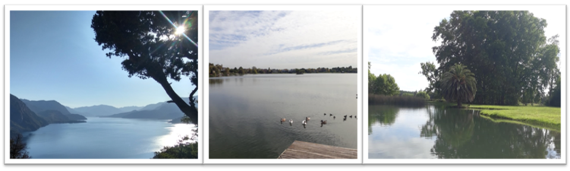
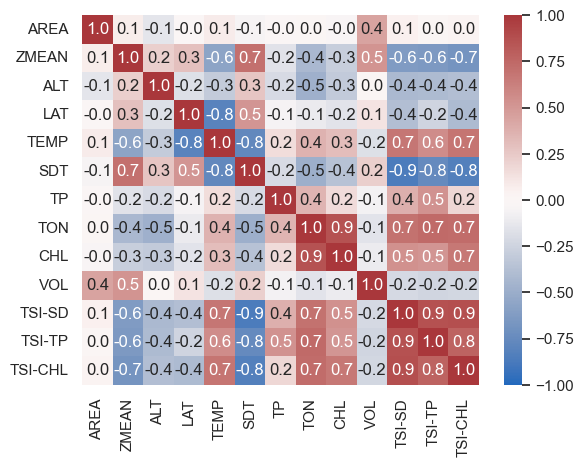
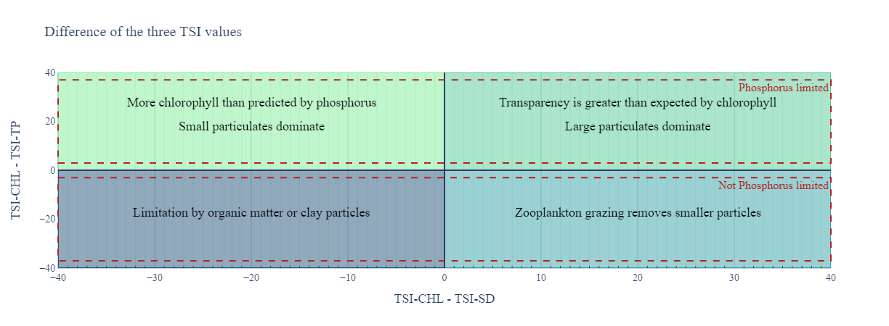

## Introduction



One of the first courses I took during my M.Sc. in Ecohydrology at UNLP was **freshwater ecology**. Being a civil engineer, I was used to analyzing different variables, especially through the use of graphs. Nevertheless, the sheer number of variables that must be taken into account when contemplating an ecological issue and the intricate interactions between the variables were both mind-blowing and intellectually stimulating. This was strengthened by my role at [**EcoAqua**][ECOAQUA], which created a two-way interaction between the need for a practical application of the concepts I was being presented in class and the theoretical validity of my approaches at work.

It was during that course that I first encountered the paper *"Relationships between air temperature, depth, nutrients, and chlorophyll in 103 Argentinian lakes[^1]"*, by Dr. Rolando Quirós. Published in 1988, the paper presents a small dataset of morphometric, climatic, and edaphic variables for 103 Argentine lakes and reservoirs. The measurements were collected during mid-summer through three consecutive summers (1984, 1985, and 1986).

Argentina is a country with a diverse geography, ranging from the cool and windy Patagonian plateau to the hot and humid subtropical "Selva Misionera". This array of biomes is reflected in the different water bodies that populate the country. Lagoons on the Pampa plains tend to form on eolic depressions, while lakes in the Patagonian Andes usually have a glacial origin. As such, ecohydrological and hydromorphic differences between regions are present and are expected to show up in the dataset.

Aside from the distinction between geographic regions, water bodies can be classified as natural or man-made. In the dataset, these are labeled as *lake* and *reservoir*. This differentiation is relevant on account of the ecohydrological differences in water and nutrient regimes between the two, mainly due to the origin of the latter with the construction of a dam through a river.

### Eutrophication & TSI

Eutrophication can be defined as *"a process of pollution that occurs when a lake or stream becomes over-rich in plant nutrient; as a consequence it becomes overgrown in algae and other aquatic plants. The plants die and decompose. In decomposing the plants rob the water of oxygen and the lake, river or stream becomes lifeless. Nitrate fertilizers which drain from the fields, nutrients from animal wastes and human sewage are the primary causes of eutrophication[^2]"*. 

Eutrophication is a pressing issue on many water bodies throughout the world, and dealing with it requires an interdisciplinary effort with insight from a wide range of people, from ecohydrologists and limnologists to state agencies and local stakeholders. 

Being an important problem for societies, the necessity of assessing the trophic state of a water body was evident. In his paper "A trophic state index for lakes"[^3], published in 1977[^4], Carlson presented his now famous **Trophic State Index (TSI)**. These indexes are powerful tools, as they help characterize and summarize the trophic state of a water body, make comparisons between water bodies, and serve as a bridge to communicate limnologic realities to the public in a less technical manner. 

Carlson's TSI were constructed in such a way that when the TSI goes up by 10, it represents a doubling of algal biomass. As algal biomass is difficult to measure, the TSI indexes are calculated based on Secchi disk transparency, total phosphorus, and chlorophyll. The formulae for the three TSI are shown below:

$$ TSI_{SD} = 60 - 14.41 {\ln}(SD) $$

$$ TSI_{TP} = 4.15 + 14.42 {\ln}(TP) $$

$$ TSI_{Chl} = 30.6 + 9.81 {\ln}(Chl) $$

Carlson and Shapiro proposed a categorical scale for TSI, in which a trophic state is assigned based on the TSI value. The key thresholds are *TSI = 30* and *TSI = 50*, as the upper limit of oligotrophic[^10] and the lower limit of eutrophic water bodies, respectively.

One extremely important note is that these TSI values ***should not*** be averaged, they must be **interpreted**[^8]. The different TSI values all point to the algal biomass, using other related variables as proxy variables. Given a particular water body, an important gap between different TSI indexes is hinting at a particular situation in the lake's limnology.

### Guiding question

With this introduction out of the way, let's delve into the main question to ask the data:

> ***What is the tophic state of lakes and reservoirs across Argentina, and which variables account for these differences***.

## Understanding the dataset
As a first step, we will take a look at the composition of the dataset and the principal characteristics of the different variables in it.

Running `data.info()` yields the following information:

```text
<class 'pandas.core.frame.DataFrame'>
Index: 103 entries, Rodeo to Ameghino
Data columns (total 11 columns):
 #   Column  Non-Null Count  Dtype  
---  ------  --------------  -----  
 0   TYPE    103 non-null    object 
 1   REGION  103 non-null    object 
 2   AREA    103 non-null    float64
 3   ZMEAN   103 non-null    float64
 4   ALT     103 non-null    int64  
 5   LAT     103 non-null    float64
 6   TEMP    103 non-null    float64
 7   SDT     103 non-null    float64
 8   TP      103 non-null    int64  
 9   TON     103 non-null    int64  
 10  CHL     103 non-null    float64
dtypes: float64(6), int64(3), object(2)
memory usage: 9.7+ KB
```

The first aspect that pops up is the absence of null values. This is expected given the origin of the dataset, but it is not a situation that commonly appears when dealing with other sources of data.

We can see that the dataset has 11 columns, two of them of `object` type, while the other 9 present numerical values. We can check some of the values by using  `data.head()`, `data.tail()` or `data.sample()`. 

Calling `data.sample(5)`:

```text
| NAME     | TYPE   | REGION           |   AREA |   ZMEAN |   ALT |   LAT |   TEMP |   SDT |   TP |   TON |   CHL   |
|----------|:-------|:-----------------|-------:|--------:|------:|------:|-------:|------:|-----:|------:|--------:|
|Verde     | lake   | Patagonian Andes |    1.4 |    18.3 |   520 | 42.72 |    5   | 11    |    4 |    23 |    0.68 |
|La Chilca | lake   | Pampa Plain      |   10   |     1.5 |    55 | 35.78 |   15.5 |  1.05 |   81 |   220 |   13.5  |
|De Lobos  | lake   | Pampa Plain      |    7.5 |     1.2 |    20 | 35.27 |   16   |  0.25 |  285 |   359 |  166.2  |
|Quichaura | lake   | Patagonian Andes |    2.5 |     3.4 |   900 | 43.55 |    7.5 |  5    |   38 |    83 |    1.1  |
|Pico 4    | lake   | Patagonian Andes |    5.3 |     6.8 |   550 | 44.27 |    5   | 12    |    9 |    24 |    1.81 |
```

We can review in the original paper what each of the fields represents:

+ **NAME (index)**: Name of the water body.
+ **TYPE**: Type of the water body.
+ **REGION**: Geographical region where the water body is located.
+ **AREA**: Area, in $km^2$.
+ **ZMEAN**: Mean depth, in $m$.
+ **ALT**: Elevation, in $m$.
+ **LAT**: Latitude, $°S$.
+ **TEMP**: Annual mean air temperature, in $°C$.
+ **SDT**: Secchi disk, measure of water body visibility, in $m$.
+ **TP**: Total phosphorus, in $mg.m^{-3}$.
+ **TON**: Total organic nitrogen, in $\mu.M$
+ **CHL**: Total chlorophyll-a, in $mg.m^{-3}$.

The two categorical variables are **TYPE** and **REGION**. We will explore which are the unique values presented in each of those columns:

```python
print(f"Unique values for 'TYPE': {data['TYPE'].unique().tolist()}")
print(f"Unique values for 'REGION': {data['REGION'].unique().tolist()}")
```
```text
Unique values for 'TYPE': ['lake', 'reservoir']
Unique values for 'REGION': ['ANW', 'Pampa Mountains', 'Cuyo', 'Pampa Plains', 'Patagonian Plateau', 'Patagonian Andes']
```

We have already mentioned why discriminating between lakes and reservoirs makes sense when analyzing trophic states. Regarding the field **REGION**, the dataset is divided[^11] into different geographical regions, which can be seen [here][GEOGRAPHICAL]. Some clarifications: "ANW" refers to "Argentine Northwest", and Patagonia was divided into "Patagonian Andes" and "Patagonia Plateau", due to the geographical differences between those areas[^5].

Let's now take a look at the descriptive statistics of the numerical fields by using `data.describe()`:

```text
|       |     AREA |    ZMEAN |      ALT |       LAT |      TEMP |       SDT |       TP |     TON |    CHL   |
|:------|---------:|---------:|---------:|----------:|----------:|----------:|---------:|--------:|---------:|
| count |  103     | 103      |  103     | 103       | 103       | 103       |  103     | 103     | 103      |
| mean  |   73.37  |  25.6107 |  583.777 |  37.2027  |  11.866   |   4.32272 |  221.854 | 100.369 |  25.7726 |
| std   |  234.396 |  36.2721 |  481.896 |   5.60313 |   5.23958 |   4.94059 |  823.341 | 125.403 |  54.056  |
| min   |    0.09  |   0.7    |    2     |  24.12    |   3       |   0.03    |    1     |   6     |   0.16   |
| 25%   |    4.35  |   3.1    |  159.5   |  34.375   |   6       |   0.675   |    9     |  21     |   0.83   |
| 50%   |   12     |   8.1    |  550     |  37.88    |  14       |   2       |   30     |  45     |   6.7    |
| 75%   |   44.3   |  33.15   |  844.5   |  42.31    |  16       |   7.25    |  125.5   | 126     |  23.75   |
| max   | 1984     | 166      | 3250     |  45.9     |  20.4     |  19       | 7912     | 762     | 405.3    |
```

There is a lot to consider in this table, but we will focus on some insights:
+ The difference between mean and median (50th percentile) is notable in a number of variables, which indicates the presence of outliers in those fields.
+ Total phosphorus, total organic nitrogen, and chlorophyll-a show a great difference between the 75% percentile and the maximum value. This situation is not present in the case of Secchi disk transparency.
+ The standard deviation for area, altitude, and total phosphorus is huge.

## Defining new fields

Having taken a look at the dataset, we will create some additional fields that should prove useful to our analysis.

```python
data['VOL'] = data['AREA'] * data['ZMEAN']
data['DEPTH'] = np.where((data['ZMEAN'] > 5), 'deep', 'shallow')
data['TSI-SD'] = 60 - 14.41*np.log(data['SDT'])
data['TSI-TP'] = 4.15 + 14.42*np.log(data['TP'])
data['TSI-CHL'] = 30.6 + 9.81*np.log(data['CHL-a'])
```

+ A **volume (VOL)** field is added as the multiplication of the water body's area and mean depth.
+ **DEPTH** is a categorical value used to divide the water bodies between shallow and deep ones. The cut was made at a mean depth of 5 meters and, while it's arbitrary[^6], represents the mean depth at which the limnological dynamics of the water body change[^7]. 
+ Columns for the three calculations of Carlson's TSI are added to the DataFrame.

Finally, we can call again `data.describe()` to see the descriptive statistics of the new fields, which prints the following:

```text
|        |       VOL |   TSI-SD |   TSI-TP |   TSI-CHL |
:--------|----------:|---------:|---------:|----------:|
|  count |   103     | 103      | 103      |  103      |
|  mean  |  2474.75  |  51.1536 |  56.1141 |   46.7439 |
|  std   |  9450.34  |  21.3082 |  26.212  |   19.384  |
|  min   |     0.324 |  17.5706 |   4.15   |   12.6224 |
|  25%   |    14.295 |  31.4623 |  35.834  |   28.7141 |
|  50%   |   109.34  |  50.0117 |  53.1953 |   49.2597 |
|  75%   |   625.145 |  65.6736 |  73.8308 |   61.674  |
|  max   | 87449     | 110.529  | 133.586  |   89.5054 |
```

## Variable correlation

One interesting step in data analysis is understanding the correlation between the different numerical variables. To accomplish this, we construct a **correlation matrix**, which can be seen below:



Looking at the correlation matrix, we can see some interesting things:

+ All TSI are strongly correlated to one another.
+ Total organic nitrogen has a strong positive correlation with AL TSI.
+ Total organic nitrogen shows a strong positive correlation to chlorophyll-a.
+ Temperature has a strong positive correlation to all three TSI.
+ Secchi disk transparency shows a strong negative correlation to all three TSI.
+ Secchi disk transparency shows a strong negative correlation to temperature.
+ Mean depth shows a strong negative correlation to all three TSI.
+ Total phosphorus does not have a strong correlation with any variable except its corresponding TSI.
The area of the lake does not correlate with any TSI.
+ Volume does not show a significant correlation to any TSI.

Given all of this information, we will embark on a quest to find out the differences (*or not!*) in trophic state between water bodies in Argentina's different regions. We will also contemplate whether the different limnological regimes of shallow and deep lakes propagate to the trophic states of those water bodies, and if the differences between reservoirs and natural lakes show themselves in the TSI.

## Regional variation of TSI

Let's see the distribution of TSI values along different geographical regions (*click on the buttons to change the TSI plotted*):



+ First thing to note in this visualization is that TSI-TP has greater variability than the other two for all regions except Cuyo.
+ Water bodies in the ANW and Pampa Mountains tend to be eutrophic, but the latter exhibits more variability. While both are comparable regarding TSI-SD, Pampa Mountains water bodies show greater values for the other two TSI.
+ Cuyo water bodies group around mesotrophic values and do not exhibit a lot of variability, neither between the different water bodies nor the different TSI.
+ Water bodies in the Pampa Plains show an important jump from TSI-SD and TSI-CHL to TSI-TP, indicating the great availability of phosphorus in those lakes.
+ Patagonian lakes and reservoirs tend to be mesotrophic[^12] and oligotrophic, with the ones in the Patagonian Plateau showing higher TSI values than the ones in the Patagonian Andes.


## Differences in TSI between lakes and reservoirs

Now we will proceed to observe the difference in TSI values between lakes and reservoirs:



+ While both types of water bodies exhibit similar median values, the lake's TSI values show more dispersion. This situation is exacerbated when considering TSI-TP.
+ Another observation to be made is that the lake group shows a somewhat bimodal distribution, with one group concentrated in oligotrophic conditions and the other in eutrophic conditions. This possibly stems from the fact that the "lake" label groups all artificial water bodies.
+ There are almost no reservoirs with an oligotrophic state.

Having taken a look at the difference between man-made and natural water bodies at a country scale, we will check for regional differences:



We gain interesting insights by performing this decoupling:

+ The lake cluster around oligotrophic conditions can be attributed to lakes in the Patagonian Andes.
+ Lakes and reservoirs in the Patagonian Plateau have very distinguishable trophic states.
+ The lake cluster around eutrophic conditions can be attributed to lakes in the Pampa Plains. They probably represent shallow lagoons.
+ Reservoirs with greater TSI values are located in the ANW and Pampa Mountains.

## Differences in TSI between shallow and deep water bodies

Let's now devote our attention to the distribution of TSI values between shallow and deep lakes:



As expected, shallow lakes have greater TSI values than deep ones, reinforcing the idea that mean depth is negatively correlated with trophic state. Depth, however, is not the only variable to take into account, and a great overlap region can be observed between shallow and deep lakes around TSI = [40, 70].

When discriminating between regions, some nuances start to appear:



+ Oligotrophic lakes are almost exclusively deep water bodies in the Patagonian Andes.
+ The difference between shallow and deep water bodies TSI is greatly reduced within each region. Some hint of lower TSI for deep water bodies within a region can be seen, but the number of samples is small.
+ There is a strong concentration of shallow water bodies in the Pampa Plains region, which in turn show great TSI values, especially for TSI-TP.

## Comparison of the three TSI values for every measurement

The trophic state indexes were developed with the intention of representing trophic state through a quantification of algal biomass, which, being difficult to measure, used other three variables that correlate to algal biomass as proxy: Secchi disk transparency, total phosphorus, and chlorophyll. The three TSI point to the same reality of the water body's trophic state and should be similar. If there are differences between the three, we have to look at them to find the cause of the difference.

In the following visualization, the three TSI are plotted for each water body. Regions can be filtered in the visualization. 

As a guide, a line was drawn where $TSI_{SD}=TSI_{TP}=TSI_{CHL}$



Looking at the visualization, there are two points to take into account:

1. *How far from the origin is a point located?* Looking at this, we can look at the trophic state of a water body. The closer to the origin, the more pristine the water body.
2. *How far from the line of equal TSI is a point located?* By observing the points that move away from the black line, we can detect water bodies where the difference in TSI values may be indicative of some particular dynamic.  

We see that Patagonian Andes lakes tend to have a lower TSI, while those located in the Pampa Plains are located at the higher end of the spectrum. In between the two, we find the bulk of water bodies from the ANW, Cuyo, Pampa Mountains, and Patagonian Plateau.

Some outlier water bodies are:
+ **ANW**: Río Hondo, El Cadillal.
+ **Pampa Mountains**: Anzulón.
+ **Cuyo**: Ullum.
+ **Pampa Plains**: Melincué, La Limpia, Epecuén.
+ **Patagonian Plateau**: Colhue Huapi.
+ **Patagonian Andes**: Agrio, Blanco.

Another way of looking at the relationship between the three TSI values is by plotting $TSI_{CHL} - TSI_{TP}$ vs. $TSI_{CHL} - TSI_{SD}$, as proposed by Carlson (1992)[^9]. This plot allows us to better visualize the possible reasons behind a difference between TSI values for a given water body. 



If $TSI_{CHL} < TSI_{TP}$, phosphorus may not be limiting chlorophyll. This can be due to grazing pressure on smaller particulates, leaving only bigger ones, resulting in more transparency than expected by chlorophyll. Another possible reason for this could be that the transparency is dominated by non-algal factors such as organic matter, color, or clay particles in suspension.

With this knowledge, we can look at where the measurements fall in this graph:



Most of the water bodies that we have identified as the ones with greater differences between their TSI values appear in the lower left quadrant, which would indicate that those water bodies are not phosphorus-limited and their low transparency values are due to organic matter or clay sediments in suspension.

Some other key points from that graph are:
+ Almost all water bodies from Cuyo and the Patagonian Plateau present higher transparency than expected from chlorophyll.
+ All Pampa Plains water bodies are not phosphorus-limited.

## Conclusions & Future Work

We have analyzed a small dataset of 103 Argentinian lakes and reservoirs, performed some exploratory data analysis, and studied the distribution of TSI values through the different regions of Argentina, along with the difference between man-made and natural lakes and between shallow and deep lakes.

The main takeaways from the study are:
1. **Water bodies exhibit different trophic states across different regions**.
2. **A great portion of Argentina's water bodies suffer from eutrophication, or report TSI indexes accordingly.** This is especially true when considering TSI-TP.
3. **Reservoirs show a mesotrophic to eutrophic state, while lakes vary widely, mainly depending on the region**. The possible reason behind the lake variation has to do with the fact that all natural water bodies were labeled as "lake", losing the distinction between lakes and lagoons.
4. **Depth, although an important factor, has lower explanatory power than expected**. It is assumed that shallow lakes are prone to eutrophication, and while that was partially observed, the differences were not consistent across different regions.

Some possible future work would involve:
1. **Improvement in the delineation of the geographical regions**. This classification was done manually and roughly, so errors could slip by. A better delineation of geographical regions or the introduction of smaller granularity in this classification would help detect regional characteristics.
2. **Discrimination between different natural water bodies**, e.g., lakes, lagoons, etc.
3. **Incorporation of more parameters into the analysis**
4. **Continuous measurements through the years** to observe seasonal and interannual variability in TSI values and TSI differences.





[ECOAQUA]: https://www.ecoaqua.com.ar
[QUIROS]: https://www.agro.uba.ar/users/quiros/
[COMPLEX]: https://en.wikipedia.org/wiki/Complex_system
[GEOGRAPHICAL]: https://en.wikipedia.org/wiki/Regions_of_Argentina
[SCHEFFER]: https://link.springer.com/book/10.1007/978-1-4020-3154-0#:~:text=Ecology%20of%20Shallow%20Lakes%20brings,many%20shallow%20lakes%20and%20ponds.
[NALMS]: https://www.nalms.org/secchidipin/monitoring-methods/trophic-state-equations/

[^1]: This article, along with many others from Dr. Quirós can be freely obtained at his UBA [website][QUIROS].
[^2]: As defined by the European Environment Agency, [here](https://www.eea.europa.eu/archived/archived-content-water-topic/wise-help-centre/glossary-definitions/eutrophication).
[^3]: The modesty of the title strikes a notable contrast to current scientific publications. It reminds me of these words by Brian Moss: *"Most of the scientific literature is written as if no one wants to communicate anything, anyway. The writing is pompous, self-serving, full of unnecessary jargon and distinctly off-putting. Quite a lot of it is deceptive in that something is written as if it is an entirely new revelation when this is far from the case."* (Ecology of freshwaters: a view for the twenty-first century / Brian Moss. — 4th ed., p.1)
[^4]: The original paper can be read for free [here](https://aslopubs.onlinelibrary.wiley.com/doi/epdf/10.4319/lo.1977.22.2.0361). 
[^5]: Lakes in the Andes tend to have a glacial origin, compared to the mostly eolic formation of lakes in the Patagonian plateau.
[^6]: Marten Scheffer roughly considers the thresholds at 3 meters; other references talk about 5 up to 10 meters.
[^7]: One excellent reference for the specifics of limnological processes in shallow lakes can be found in the book [*"Ecology of Shallow Lakes"*][SCHEFFER] by Marten Scheffer.
[^8]: *"Perhaps this is just a natural tendency for humans to seek the central tendency, or it might reflect the concept that trophic state is defined by a number of variables. Whatever the reason, averaging makes no sense at all. The index is predicated on the idea that it is predicting algal biomass. Chlorophyll is a better predictor than either of the other two indices."["Trophic State Equations (NALMS)"][NALMS]*
[^9]: Carlson, R.E. 1992. Expanding the trophic state concept to identify non-nutrient limited lakes and reservoirs. pp. 59-71 [In] Proceedings of a National Conference on Enhancing the States’ Lake Management Programs. Monitoring and Lake Impact Assessment. Chicago.
[^10]: Oligotrophic refers to an environment low on nutrients.
[^11]: The "REGION" field was added manually by me. In the original paper, the different locations were marked on a map.
[^12]: Mesotrophic are water bodies in between oligotrophic and eutrophic.