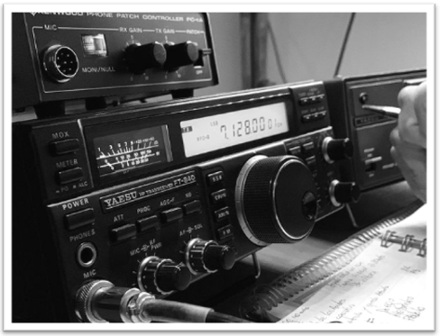

## Introduction



Amateur Radio, also referred to as ham radio, is a hobby and service that brings people, electronics, and communication together. People use ham radio to talk across town, around the world, or even into space, all without the Internet or cell phones. It's fun, social, educational, and can be a lifeline during times of need. Hams set up stations in a club, at home, in their vehicles, and in the field[^1]. Some even climb to "activate" (transmit and make contacts from) mountain summits[^2].

Hams use radios(*transceivers*) and antennas to communicate via radiofrequency. It's a technical and diverse hobby that offers different flavors for different people, with some focusing on DX (long distance communications), others on contests, Morse code (known as CW by hams), kit building, or just chatting. 

> *If you want to know more about ham radio, you can check the [Appendix](#appendix).*

Most countries have a communications agency that is in charge of managing the frequencies for different uses. In Argentina, that agency is [ENACOM](https://www.enacom.gob.ar/), and it publishes every 3–4 months a list of all active licenses in the country. Being an amateur radio operator[^3] and a data analyst myself, this dataset begged to be dissected. 

The north star of this effort could be summarized as follows:

> *What is the distribution of amateur radio licenses across Argentina? How do the licenses split in the different amateur radio categories? Can I discover some of the variables that explain these differences?*

## Loading relevant data

First, I downloaded the XLSX file that contains the dataset from ENACOM's site. While ENACOM offers an API, it doesn't offer any additional advantage to downloading the file, as the listed resource points to the same URL for downloading the file. 

Additionally, I created a CSV file with relevant characteristics of the different provinces of Argentina[^4]. This CSV contains the following fields:

+ **province(index)**, province's name.
+ **population**, in number of people (obtained from [provisional 2022 census results][CENSUS])
+ **area**, in $km^{2}$. [*(Source)*][WIKIPEDIA]
+ **salaries**, which refers to the monthly mean individual salary for each province, for February 2023. [*(Source)*][SALARIES]

Finally, I loaded a GeoJSON of Argentina's provinces [(*Source*)](https://www.kaggle.com/datasets/pablomgomez21/geojson-file-provincias-argentinas). This would be useful later on for making maps.

## Looking and preparing the data

I began by looking at the dataset, using `df.head()`:

```text
|    | Titular de la Licencia              | Señal Distintiva   | Categoría   | Expiración          | Provincia              | Localidad                       |
|---:|:------------------------------------|:-------------------|:------------|:--------------------|:-----------------------|:--------------------------------|
|  0 | PROTECCION CIVIL (MIN. SEG. NACION) | LU0CD              | SUPERIOR    | 2025-05-21 00:00:00 | Ciudad de Buenos Aires | CIUDAD AUTONOMA DE BUENOS AIRES |
|  1 | ARTURO JORGE PEYRU                  | LU1AAA             | NOVICIO     | 2024-05-07 00:00:00 | Ciudad de Buenos Aires | CIUDAD AUTONOMA DE BUENOS AIRES |
|  2 | CHRISTIAN LUIS DIAZ                 | LU1AAB             | NOVICIO     | 2024-04-26 00:00:00 | Ciudad de Buenos Aires | CIUDAD AUTONOMA DE BUENOS AIRES |
|  3 | WENCESLAO BERNARDINO MOREL          | LU1AAC             | GENERAL     | 2024-05-16 00:00:00 | Ciudad de Buenos Aires | CIUDAD AUTONOMA DE BUENOS AIRES |
|  4 | JUAN ANTONIO BILOTA                 | LU1AAD             | NOVICIO     | 2024-08-14 00:00:00 | Ciudad de Buenos Aires | CIUDAD AUTONOMA DE BUENOS AIRES |

```

The dataset contains the name of the license holder, the callsing, the category, the expiration date, and the province and city of the holder's station.

Afterwards, I performed some data manipulation operations:

1. Renamed columns to more convenient and English[^5] names.
2. Removed leading and trailing spaces from all columns of the `object` type.
3. Added the same style to strings in `category` and `city` (capitalize the first letter of every word).
4. Renamed all entries in `province` column belonging to three provinces with `df['province].replace()`. This was done to get a uniform name for all provinces across resources.
5. Changed `df['expiration_date]` to DateTime.

```python
# Renaming the columns for ease of use
df = df.rename(columns={
    'Titular de la Licencia': 'license_owner',
    'Señal Distintiva': 'callsign',
    'Categoría': 'category',
    'Expiración': 'expiration_date',
    'Provincia': 'province',
    'Localidad': 'city'
})

# Remove leading or trailing spaces for all object columns
for column in df.columns:
    if df[column].dtype == object:
        df[column] = df[column].str.strip() 

# Apply same format to category and city column
df['category'] = df['category'].str.title()
df['city'] = df['city'].str.title()

# Rename province names to adhere to a standard
df['province'] = df['province'].replace({
    'Provincia de Buenos Aires': 'Buenos Aires',
    'Ciudad de Buenos Aires': 'Ciudad Autónoma de Buenos Aires',
    'Tierra del Fuego A. e I.A.S.': 'Tierra del Fuego, Antártida e Islas del Atlántico Sur'
})
```

Next, I checked for NaN values. The dataset contains 3 entries with NaN in the *province* and 6 *city* columns. While I can't guess the city of the license holder, I can fill in the NaN values of the *province* column by looking at the callsign. This is due to the fact that the suffix[^6] contains information about the holder's province: e.g., if a license begins in "*LU8Y*" the "*Y*" tells me that the holder is in Neuquén province. For that purpose, I wrote a small function that looks at the first two digits of the suffix and returns a province name, and I applied it to NaN values.

> *Ever wonder the meaning behind those callsigns that hams put on their trucks, homes, email addresses and evolve into surname status? Check out the [Appendix](#appendix) to find out*. 

The last step of the data manipulation stage consisted of creating a GeoDataFrame, in which the province's characteristics were bundled with the province's polygons from the GeoJSON file. I grouped licenses by province (total and differentiated by category) and added that information to the GeoDataFrame. Finally, I created additional fields that will come in handy: "*pop_density*", "*latitude*"[^7], "*licences_per_perc*" (total licenses as percentage of population).

## Analyzing the data, and yes! Visualizations!

Having the proper data in place, I started looking at the numbers, or more correctly, at the graphs.

First, I plotted the total number of licenses per province, as seen below:



There are some remarkable insights to be gained from the data. First, it's astonishing to see the difference between the number of licenses in the province of Buenos Aires (PBA) compared to the rest of the country's provinces. I expected to see a great number of licenses concentrated in PBA, Ciudad Autónoma de Buenos Aires (CABA), Córdoba, and Santa Fe provinces, but I would have never guessed that PBA contained more licenses than those three (CABA, Córdoba, and Santa Fe) combined. 

Another realization is that there aren't many amateur radio operators in the country. Taking Neuquén as an example, 255 licenses is not a big number, and there is a big probability of eventually knowing or having heard most of them on the airwaves[^8].

Let's take a look at the cumulative percentage of licenses:



There's not much to add, except that half of the country's licenses are located in PBA and CABA and that five of the 24 provinces account for 3/4 of all licenses.

While this analysis was interesting on its own, I thought that it wasn't particularly fair, as the difference in population, area, and, consequently, population density between provinces is significant. For that reason, I calculated the number of licenses as a percentage of each province's population. The result can be seen below:



Well, *that* was interesting. This metric reshaped the order drastically. The four first provinces in the list correspond to regions that cover almost the entirety of Patagonia. Also, the relative importance of the number of licenses in the PBA dropped dramatically. 

We can actually make a choropleth map to see this relationship more clearly:



There is a clear gradient toward the south of the country. We should be able to see that relationship in a scatter plot:



*What could be the cause behind this relationship?* Latitude in itself is not an explanatory variable that can elucidate the higher number of licenses relative to the population, but it surely points to some conditions present in the south of the country.

Given the fact that the largest provinces in the country are located in Patagonia, let's explore the relationship between relative license population and province area:



We observe some dispersion in this relationship, suggesting that, while area is an important part of the puzzle, it is not the whole answer. On top of that, we see that Tierra del Fuego and Chubut show way bigger licenses than would have been predicted based on their area, and that PBA exhibits the opposite situation.

As we observe that area plays a role in the explanation, I decided to observe the role of population density in license number relative to population:



I suspected that population density should play an important role in explaining the differences in relative license numbers between provinces. The idea was that unpopulated regions of the country would have less infrastructure and connectivity services, and radio would play an important role in their inhabitants' lives. Contrary to what I expected, there is no clear relationship between population density and the relative number of licenses. Tierra del Fuego, Santa Cruz, and Chubut show a great number of licenses given their low density, but a lot of other provinces with low population density exhibit a lower relative number of licenses. A note should be made about CABA that, given its extremely high population density (we are talking about a city, after all), cannot be compared to this analysis.

Lastly, given the fact that amateur radio equipment *can* be costly[^9], I decided to check the relationship between salaries and amateur radio licenses:



To my surprise, we can see a relationship between the two variables. However, a greater analysis would be needed to determine if salary is in fact an explanatory variable or just happens to be correlated with other explanatory variables such as area or latitude. In fact, employees in Patagonia provinces have a *Zona Desfavorable* ("unfavorable zone") benefit that is quite significant.

Finally, almost as a bonus track, I decided to check the number of licenses in every category:



As expected, the number of licenses drops with each subsequent category[^10], as many people don't feel the need to keep upgrading their licenses (which involves taking an exam).

## Conclusions & Future Work

This project has been a fun way of honing my data skills while tackling an inquiry I've had for some time, and it's centered around my interests. The conclusions I've reached can be summarized as follows:

1. **Patagonia's provinces show an abundance of amateur radio licenses relative to their population**. This can be attributed to the low population, greater distances, and lack of infrastructure in this region.
2. **The number of licenses is extremely unevenly distributed across the territory**, with almost half of the licenses located in the province of Buenos Aires.
3. **The average salary of a population could have some explanatory power regarding the difference,** but it seems to be entangled with other, more relevant conditions of the regions that exhibit a greater relative license number.

There were some additional analyses or operations I would like to do, but in order to keep this effort constrained, I prefer not to do so. 

1. Some licenses belong to people, while others belong to institutions. This separation is very relevant, but it is not so easy to do.
2. In the same vein, the dataset does not provide personal information such as genre, age, or any other metric that could be used to go one layer deeper with the analysis.
3. While the dataset provides a *"city"* field, entries are misspelled, misnamed, or truncated. It would have been great to be able to map the location of every license, as it would serve as a very nice diagram and could potentially show additional insights.




## Appendix

The following video conveys a glimpse of the different possibilities and activities inside the amateur radio space:



Regarding the callsign composition, each one is made up of a **prefix**, a **separating numeral,** and a **suffix**. In Argentina, amateur radio licenses tend to have the LU or LW suffix, followed by an arbitrary number and a suffix. The first letter of the suffix indicates the location of the license's owner. CABA and PBA have more than one letter assigned to them (e.g., all suffixes beginning with A, B, or C belong to CABA), and some provinces share the first letter of the suffix, and the second letter differentiates one from another (e.g., GA to GO (inclusive) correspond to the province of Chaco, and GP to GZ (inclusive) correspond to the province of Formosa). More on the nuances of amateur radio callsigns can be read on the corresponding [Wikipedia page](https://en.wikipedia.org/wiki/Amateur_radio_call_signs).

[^1]: Paraphrased from the [ARRL website](http://www.arrl.org/what-is-ham-radio) (*American Radio Relay League*).
[^2]: This activity is called [SOTA](https://www.sota.org.uk/) (*Summits on the Air*)
[^3]: Although I have passed the requirements to obtain a license and a callsign, that process is delayed. In the meantime, I regularly meet with other hams at our local radio club, [*Radio club de los Andes (LU8YE)*](https://www.qrz.com/db/LU8YE).
[^4]: While this data (along with uniformed names and codes for provinces) can be obtained from Argentina's [Open Data](http://www.datos.gob.ar), for ease of use, it was just manually assembled. The number of provinces and the small number of fields collected justify this process.
[^5]: I do not consider "$English > Español$". In fact, I love my mother tongue. But pragmatism dictates this change to match the article's language.
[^6]: In almost every other country, the prefix and the number are the ones that deliver geographical information. Not in Argentina, though.
[^7]: "*Latitude*" field corresponds to the latitude of the centroid of the province polygon.
[^8]: This is magnified by the fact that the 255 number includes institutions (radio clubs, military garrisons), some silent operators, and that not all hams operate on the same modes or bands. The chance of getting to know the regional fellow hams is pretty big.
[^9]: One good thing about the hobby is that old equipment, if not poorly treated, is completly functional and can deliver a extremely pleasant time. Not all activities can boast about this. But new radios and commercially made antennas can cost *a lot* of money.
[^10]: "Especial" category is not an upgraded category to "Superior". These are callsigns solicited by a ham or a radio club for an special ocassion, aniversary or event.

[CENSUS]: https://www.indec.gob.ar/indec/web/Nivel4-Tema-2-41-165
[WIKIPEDIA]: https://en.wikipedia.org/wiki/Provinces_of_Argentina
[SALARIES]: https://datos.gob.ar/dataset/produccion-salarios-promedio-mediano-por-provincia-sector-actividad/archivo/produccion_8ed16580-cc11-48ba-8ba3-81ab3c95b6da
